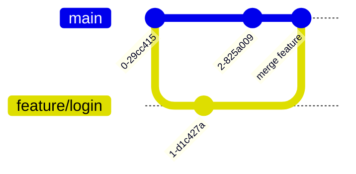

# Справочник по Git для начинающих

## 0. Авторизация через ssh ключ

Генерация пары ключей и вывод публичного ключа
```bash
ssh-keygen -q -t ed25519 -N '' -f .ssh/github_key
cat .ssh/github_key.pub
```

В настройках профиля добавляем публичный ключ:


## 1. Инициализация репозитория

```bash
git init
```

**Пример:**


## 2. Добавление файлов в staging area

```bash
git add index.html
git commit -m "Initial commit"
```

**Визуализация изменений:**


## 4. Создание веток

```bash
git branch feature/login
git checkout feature/login
```


**Ветвление:**


## 5. Слияние веток

```bash
git merge feature/login
```

**Пример слияния:**


## 6. Работа с тегами

```bash
git tag v1.0.0
```

**Тегирование:**


## 7. Отмена изменений

```bash
git revert <commit-hash>
```
**Пример отката:**


## 8. Работа с удалённым репозиторием

Отправить изменения в удаленный репозиторий
```bash
git remote add origin https://github.com/user/repo.git
git push -u origin main
```

**Синхронизация:**


Получить изменения из удаленного репозитория
```bash
git pull
```

Клонировать репозиторий
```bash
git clone https://github.com/user/repo.git
```

## 9. Пул реквесты (Pull Requests)
Это механизм для уведомления о изменениях в ветке репозитория и их согласования с командой. Используется на платформах GitHub, GitLab и Bitbucket.

**Создание пул реквеста на GitHub:**

1. Отправьте ветку на сервер:
```bash
git push origin feature-branch
```
    
- Перейдите на страницу репозитория → вкладка “Pull Requests” → “New Pull Request”.


    
- Выберите базовые и сравниваемые ветки, добавьте заголовок и описание.
